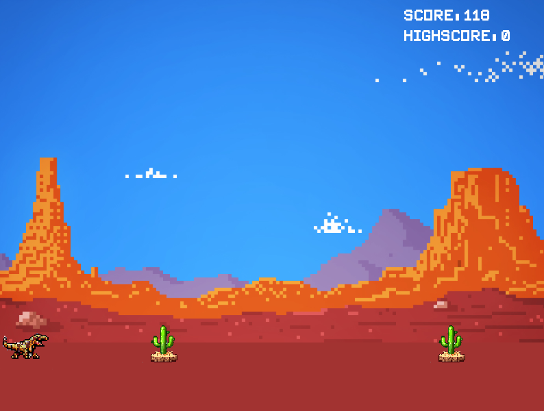

# C++ Dino Game (Under Development)



## Description

This GitHub repository contains a fun and challenging game inspired by the classic Google Chrome Dinosaur game. The game is developed in C++ using modern programming techniques and libraries to create an engaging and entertaining experience. Please note that the project is currently under development, and additional features and improvements may be added in future updates.

## Features

- Still need to be added.

## Requirements

- C++ Compiler: The game is built using C++ programming language, so you will need a compatible C++ compiler to compile and run the game.
- Libraries: The game relies on SFML (Simple and Fast Multimedia Library) for graphics, window management, and system interaction. Make sure to install the required libraries before compiling the game.

## Compilation and Testing

To compile and test the game, follow these steps:

1. Ensure you have `g++` (GNU C++ Compiler) installed on your system.

2. Install SFML library by following the instructions on the official website: https://www.sfml-dev.org/download.php

3. Clone this repository to your local machine using the following command:

```
git clone https://github.com/leoxsys/Dinogame.git
```

4. Navigate to the project directory:

```
cd Dinogame
```

5. Compile the `dino.cpp` source file using the provided `g++` command:

```
g++ -o dino dino.cpp -lsfml-graphics -lsfml-window -lsfml-system
```

6. Run the compiled executable:

```
./dino
```

8. Enjoy playing the C++ Google Dino Game!

## Contributing

Contributions to the project are welcome! Whether it's bug fixes, new features, or optimizations, feel free to submit pull requests, report issues, or participate in discussions to improve the game.

## License

The game is licensed under the MIT License, granting users the freedom to use, modify, and distribute the code for personal or commercial purposes.

## Acknowledgments

This project was created with the assistance of Bing AI, providing inspiration and support during the development process.
